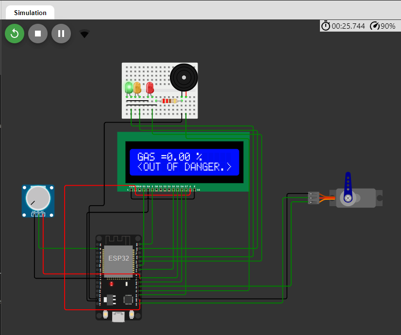
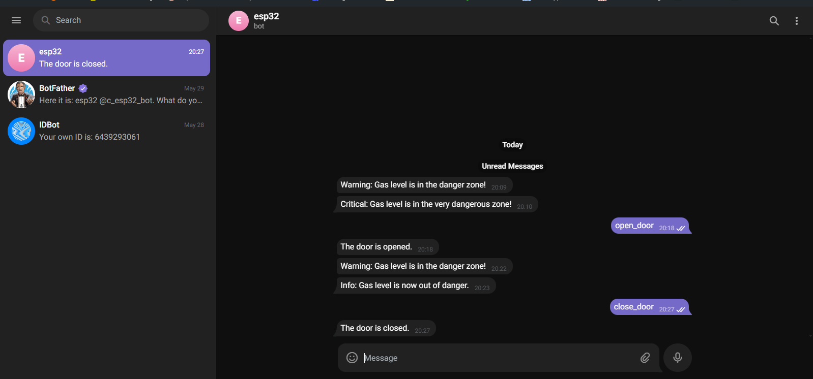

# Gas Detector with Telegram Notifications

This project is a gas detector system using an ESP32 that monitors gas levels, triggers an alarm based on predefined thresholds, and sends notifications via Telegram. It also features a servo-controlled door that can be opened or closed remotely through Telegram commands.

## Features
- **Gas detection** using a gas sensor (e.g., MQ-2, MQ-135) connected to the ESP32.
- **Visual indicators**: Green, Orange, and Red LEDs to indicate gas levels.
- **Alarm system**: Buzzer for alarming when gas levels are dangerous.
- **Telegram notifications**: Sends notifications when gas levels enter danger zones.
- **Remote door control**: Can open or close a door using Telegram commands.
- **LCD Display**: Shows the gas levels and status on a 16x2 LCD.

## Requirements
- ESP32
- Gas sensor (e.g., MQ-2, MQ-135)
- Servo motor for door control
- LEDs (Green, Orange, Red)
- Buzzer
- 16x2 LCD Display
- Wi-Fi connection
- Telegram account for bot creation

## Installation
**Configure the project:**
   - Copy the `config.h.example` file and rename it to `config.h`:
     ```bash
     cp config.h.example config.h
     ```
   - Open the `config.h` file and replace the placeholder values (`YourSSID`, `YourPassword`, `YourTelegramBotToken`, `YourTelegramChatID`) with your own Wi-Fi and Telegram bot information.

## Usage
- **Gas Detection**: The system continuously monitors gas levels. If the gas percentage crosses certain thresholds, it triggers different warnings:
  - Below 25%: **Safe (Green LED)**.
  - Between 25% and 50%: **Danger (Orange LED and buzzer)**.
  - Above 50%: **Very Dangerous (Red LED and louder buzzer)**.
  
- **Telegram Notifications**:
  - The system sends a message to the specified Telegram chat if gas levels become dangerous.
  - Commands available via Telegram:
    - `/open_door`: Opens the servo-controlled door.
    - `/close_door`: Closes the door.



